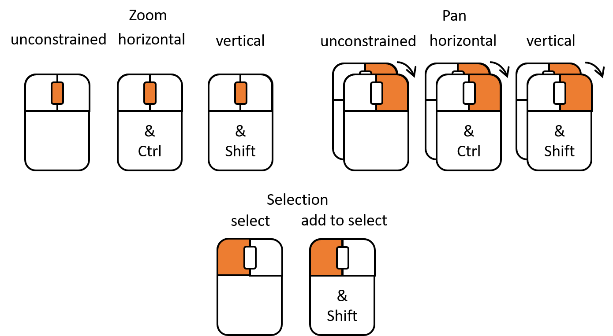

  
```{r setup, include=FALSE}
knitr::opts_chunk$set(echo = TRUE, eval = TRUE)
library(knitr)
set.seed(12314159)
```

---

$\renewcommand{\tr}[1]{{#1}^{\mkern-1.5mu\mathsf{T}}}$
$\renewcommand{\ve}[1]{\mathbf{#1}}$
$\renewcommand{\sv}[1]{\boldsymbol{#1}}$
$\renewcommand{\pop}[1]{\mathcal{#1}}$
$\renewcommand{\samp}[1]{\mathcal{#1}}$
$\renewcommand{\imply}{\Longrightarrow}$
$\renewcommand{\given}{~\vert~}$
$\renewcommand{\suchthat}{~:~}$
$\renewcommand{\widebar}[1]{\overline{#1}}$
$\renewcommand{\wig}[1]{\tilde{#1}}$
$\renewcommand{\bigwig}[1]{\widetilde{#1}}$
$\renewcommand{\field}[1]{\mathbb{#1}}$
$\renewcommand{\Reals}{\field{R}}$
$\renewcommand{\abs}[1]{\left\lvert ~{#1} ~\right\rvert}$
$\renewcommand{\size}[1]{\left\lvert {#1} \right\rvert}$
$\renewcommand{\tr}[1]{{#1}^{\mkern-1.5mu\mathsf{T}}}$
$\renewcommand{\norm}[1]{\left|\left|{#1}\right|\right|}$
$\renewcommand{\intersect}{\cap}$
$\renewcommand{\union}{\cup}$

# Introduction
Micromaps are data visualization tools that link statistical information to maps, and are very helpful for performing geospatial data analysis (e.g. see @carr2010visualizing, @symanzik2017micromaps).  Pioneered by Dan Carr, Linda Pickle and their co-authors in a series of papers and in the book @carr2010visualizing, they have been implemented in several \code{R} packages including

- `maptools` @lewin2012package.
- `micromap` @payton2015micromap, and
- `micromapST` @pickle2015micromapst.

Micromaps, and especially conditioned choropleth maps, are most valuable when they are also interactive and permit brushing and interaction with other plots (e.g. see @carr2002interactive and @symanzik2014exploratory).
This makes them particularly well-suited to development with the \code{loon} package @waddell2016thesis, @loonR.

In this vignette, we illustrate the functionality of interactive micromaps and conditional choropleth maps in loon, as implemented in the package `loon.micromaps`.

```{r load package, message = FALSE, warning = FALSE}
library(loon.micromaps)
```


# Canadian census data

## Spatial data:  Canadian census divisions

To conduct its decennial census of the population of Canada, Statistics Canada divides Canada into geographic "census divisions" or "cd"s.  The spatial polygons for these divisions are contained in 

```{r Canadian census divisions, eval = FALSE}
data("cd_Canada_2006")
``` 

Much of the population of Canada is found in southwestern Ontario; the census divisions of this part of the country have been extracted for convenience and saved as a "SpatialPolygonsDataFrame" object (defined by package `sp`), and looks like Figure \ref{fig:fig1} when plotted:

```{r southwestern Ontario census divisions, fig.width = 4, fig.height = 4, fig.cap = "\\label{fig:fig1}South Western Ontario Census Divisions"}
data("cd_SWOntario_2006")
class(cd_SWOntario_2006)

names(cd_SWOntario_2006)

plot(cd_SWOntario_2006, 
     main = "Canadian census divisions", 
     sub = "South western Ontario")
``` 

## Canadian demographics census data

We also have Canadian demographic data from the 2006 census for each census division.

```{r Canadian demographics}
data("canada_demographics_2006")
str(canada_demographics_2006)
```

Here `id` is the census division `id` and the remaining variables are values recorded in the 2006 census for those divisions (the last two variables are transformations of the first two).

## Merging the data

To construct a micromap based on these values, the demographic data of interest must be merged with the spatial data:

```{r merging canadian data into spatial data frame}
cd_SWOntario_2006@data <- merge(cd_SWOntario_2006@data, canada_demographics_2006,
                                all.x = T, all.y = F, by.y = 'id', by.x = 'CDUID')

names(cd_SWOntario_2006@data)
```

## Linked micromaps

The following creates the linked micromaps display with percent immigrant population, population density and education rate for the south western Ontario census divisions, as well as the histogram of cube root of the population density. The data points are linked using census division names as the ```linkingKey```. The result is shown in Figure \ref{fig:fig2}

Two inspectors accompany the display - the usual ```loon``` inspector and the custom inspector for linked micromaps, which allows for updating many aspects of the display. 

```{r canadian data linked micromap, eval = FALSE}
mm <- l_micromaps(spdf = cd_SWOntario_2006,
                  lab.label = 'Census Divisions',
                  variables = list(id.var = 'CDNAME',
                                   grouping.var = 
                                     list(name = 'pct_immigrants',
                                          xlab = 'percent'), 
                                   var2 = list(name = 'pop_density', 
                                               xlab = 'Pop per sq. km'),
                                   var3 = list(name = 'bachelor_above', 
                                               xlab = 'percent')),
                  spacing = 'equal', n_groups = 5,
                  linkingGroup = 'SWOntario', 
                  linkingKey = cd_SWOntario_2006@data$CDNAME,
                  sync = 'push',
                  showItemLabels = TRUE, 
                  itemLabel = cd_SWOntario_2006@data$CDNAME)

l_hist(cd_SWOntario_2006@data$"pop_density_cuberoot", 
       xlabel = "Cube root of population density per square km",
       showScales = TRUE, showGuides = TRUE,
       yshows = "density",
       linkingGroup = 'SWOntario', 
       linkingKey = mm$linkingKey)
```

```{r, echo = FALSE, fig.cap="\\label{fig:fig2}South Western Ontario Demographics, Linked Micromaps and Histogram"}
knitr::include_graphics("figures/canada_micromaps.png")
```

The ```l_micromaps``` function returns the Tk toplevel window object, ```linkingGroup``` value, ```linkingKey``` values, and the handles for the loon plot objects corresponding to the legends panel, scatterplot panel(s) and map panel in list form. This makes it possible to modify the plot objects after the display is created. For example, the following updates the color of points in the first group (result in Figure \ref{fig:fig3}):

```{r, eval = FALSE}
l_configure(mm$scatterplots[[1]][1], color = 'red')
```

```{r, echo = FALSE, fig.cap="\\label{fig:fig3}Updated Linked Micromaps", out.width = "80%", fig.align = "center"}
knitr::include_graphics("figures/canada_micromaps_configure.png")
```

The main interactive features of linked micromaps is the linkage of data points and certain plot attributes between various panels/columns. Figure \ref{fig:fig4} shows how to zoom, pan and select points using mouse and keyboard gestures.

```{r, echo = FALSE, fig.cap="\\label{fig:fig4}Mouse and Keyboard Gestures for Zoom, Pan and Selection", out.width = "75%", fig.align = "center"}

```

## Conditioned choropleth maps

The following creates the conditioned choropleth maps display, optimized for $R^2$. Again, there are two inspectors - ```loon``` inspector and the custom inspector for the conditioned choropleth maps display. The result is shown in Figure \ref{fig:fig5}. 

Conditioned choropleth maps can be seen as a simple fitted model on the response variable [@carr2010visualizing] (```pct_immigrants``` in this example). The $R^2$ statistic is defined as:

\[ R^2 = \frac{\sum_{i=1}^n (\textrm{model value}_i - \textrm{grand mean})^2}{\sum_{i=1}^n (\textrm{actual value}_i - \textrm{grand mean})^2}\textrm{ ,} \]

where actual value is the observed data, grand mean is the overall mean for the response variable, and model value is the mean of the response value in each of the panels. It can be understood as the percentage variability in the response explained by panel membership. A grid search is conducted to find a good fit, although it does not guarantee a global optimum and is intended as a starting point for your data exploration. 

```{r canadian data ccmap, eval = FALSE}
cc <- l_ccmaps(spdf = cd_SWOntario_2006,
               respvar = 'pct_immigrants', respvar.lab = '% Immigrant Population',
               cond1var = 'bachelor_above', cond1var.lab = '% with Bachelor Education',
               cond2var = 'pop_density', cond2var.lab = 'Population Density',
               seg1col = 'yellow', seg3col = 'orange',
               respscale = 'log', cond1scale = 'actual', cond2scale = 'log',
               optimize = TRUE, otry = 20)
```

```{r, echo = FALSE, fig.cap="\\label{fig:fig5}South Western Ontario Demographics, Conditioned Choropleth Maps"}
knitr::include_graphics("figures/canada_ccmaps.png")
```

Note that when ```optimize = TRUE```, the code will take some time to run depending on the value of ```otry```. 

The handles on the three sliders can be shifted left and right to adjust the colors and panel membership, with the $R^2$ value updated accordingly. The sliders can be drawn in three scales: actual/unchanged, percentile and logarithmic (see inspector). Note that the logarithmic scale can only be used when all values are above zero. 

# U.S. lung and bronchus cancer mortality rates

## Spatial data:  U.S. states

There are many sources for U.S. state polygons, one of which is the ```micromap``` R package. It is a "SpatialPolygonsDataFrame" object, with simplified edges, the states of Alaska and Hawaii transformed into insets next to the contiguous states, and Washington DC as its own separate polygon. It can be accessed using 

```{r us states}
data('USstates', package = 'micromap')
```

```USstates```, when plotted, looks like Figure \ref{fig:fig6}.

```{r us states plot, fig.width = 4, fig.height = 4, fig.cap = "\\label{fig:fig6}U.S. States"}
class(USstates)

names(USstates)

plot(USstates, 
     main = "U.S. states")
```

## U.S. lung and bronchus cancer mortality data

In addition to the lung and bronchus cancer mortality rate by state [@CDCa], we collected two other variables of interest - the annual income per capita [@BEA] and annual average of daily outdoor fine particulate matter levels [@CDCb], measured in $\mu g / m^3$, averaged over the years 2009 - 2011.

```{r us lungmort data}
data('us_lungmort_2009_2011')
str(us_lungmort_2009_2011)
```

Here, ```income``` (income per capita) is measured in $1,000's. 

## Merging the data

To construct a micromap based on these values, the data of interest must be merged with the spatial data:

```{r merging us data into spatial data frame 2}
USstates@data <- merge(USstates@data, us_lungmort_2009_2011,
                       all.x = T, all.y = F, by.y = 'state.abbr', by.x = 'ST')

names(USstates@data)
```

## Linked micromaps

The following creates the linked micromaps display with variables in ```us_lungmort_2009_2011```, with the result shown in Figure \ref{fig:fig7}:

```{r us linked micromaps, eval = FALSE}
mm <- l_micromaps(lab.label = 'States',
                  spdf = USstates,
                  variables = list(id.var = 'ST_NAME',
                                   grouping.var = list(name = 'lung_bronch_death'),
                                   var2 = list(name = 'pm25', 
                                               label = 'Fine Particulate Matter Level'),
                                   var3 = list(name = 'income', 
                                               label = 'Income per Capita')),
                  linkingGroup = 'States', sync = 'push',
                  spacing = 'equal',
                  itemLabel = as.character(USstates@data$ST_NAME),
                  showItemLabels = TRUE, otry = 20)
```


```{r, echo = FALSE, fig.cap="\\label{fig:fig7}U.S. Lung and Bronchus Cancer Mortality, Linked Micromaps"}
knitr::include_graphics("figures/us_micromaps.png")
```

## Conditioned choropleth maps

The following creates the conditioned choropleth maps display with variables in ```us_lungmort_2009_2011```, optimized for $R^2$. Figure \ref{fig:fig8} shows the resulting display.

```{r us ccmaps, eval = FALSE}
cc <- l_ccmaps(spdf = USstates, title = 'CCmaps',
               respvar = 'lung_bronch_death', respvar.lab = 'Lung & Bronchus Cancer Death Rate',
               cond1var = 'pm25', cond1var.lab = 'Fine Particulate Matter Level',
               cond2var = 'income', cond2var.lab = 'Income per Capita',
               respscale = 'actual', cond1scale = 'actual', cond2scale = 'actual',
               optimize = TRUE)
```

```{r, echo = FALSE, fig.cap="\\label{fig:fig8}U.S. Lung and Bronchus Cancer Mortality, Conditioned Chorpleth Maps"}
knitr::include_graphics("figures/us_ccmaps.png")
```

\vspace*{5cm}

# References

